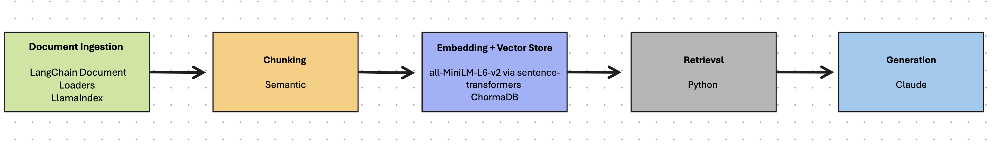

# Project 1 Planning: The Unofficial Guide

> Write this document before you write any pipeline code.
> Your spec and architecture diagram are what you'll use to direct AI tools (Claude, Copilot, etc.) to generate your implementation — the more specific they are, the more useful the generated code will be.
> Update the Retrieval Approach and Chunking Strategy sections if you change your approach during implementation.
> Update this file before starting any stretch features.

---

## Domain

<!-- What domain did you choose? Why is this knowledge valuable and hard to find through official channels? -->
This is the Unofficial guide for helping with students if they face homelessness or food shortages while in college. The need for this guide is necessary, due to the fact more than 1.5 million college students are homeless during their collegiate career. The guide will answer questions on where to obtain resources.    
---

## Documents

<!-- List your specific sources: URLs, subreddit names, forum threads, or file descriptions.
     Aim for at least 10 sources that together cover different subtopics or perspectives within your domain. -->

| # | Source | Description | URL or location |
|---|--------|-------------|-----------------|
| 1 |UNT Dallas|Resource for emergency assistance at UNTDallas| https://www.untdallas.edu/finaid/apply/emergency-funding.php|
| 2 |Dallas Housing Authority | Resources from the city of Dallas | https://dhantx.com/applicants/emergency-housing-resources/ |
| 3 |Salvation Army |Salvation Army's program for homelessness |https://salvationarmyntx.org/north-texas/carr-p-collins-social-service-center/provide-housing|
| 4 |Austin Street Center |Requirements, referrals for Austin Street Center's program | https://austinstreet.org/wp-content/uploads/2024/12/ASC-Resource-Guide-2024.pdf |
| 5 | Dallaslife|Instructs customers on intake process |https://dallaslife.org/place-to-stay/|
| 7 | Under 1 Roof| Provided services| https://www.under1roofdallas.org/faq?questionId=0f50598c-e23b-4c41-9625-f4cb302a2547|
| 8 | Housing Forward| Describes Dallas resources from churches and none profits| https://housingforwardntx.org|
| 9 |Inspired Vision Compassion Center | Services provided by the center| https://www.ivcompassion.org/|
| 10 |Hoy Trinity |Food pantry of the church |https://htdallas.org/ht-food-pantry/|
| 11 |UNT Denton|UNT Denton emergency support for students |https://www.unt.edu/onestop/student-emergency-support-program.html |
| 12 |UNT Denton|UNT Denton food pantry |https://studentaffairs.unt.edu/desresources/programs/food-pantry/hours.html |
| 13|UT Dallas | Resource hub for students at UT Dallas |https://basicneeds.utdallas.edu/resource-hub/ |
| 14 |Dallas College | Student care networking and housing|https://www.dallascollege.edu/resources/student-care-network/housing/|
| 15 |UT Dallas | Resource hub for students at UT Dallas |https://basicneeds.utdallas.edu/resource-hub/ |
| 16 | Reddit|Users providing housing resources |https://www.reddit.com/r/Dallas/comments/1hdmir3/help_with_the_unhoused/ |
| 17 |SchoolHouse Connection| Tips on being homeless |https://schoolhouseconnection.org/article/tips-for-helping-homeless-youth-succeed-in-college |
| 18 |Reddit| Students discussing homeless resources |https://www.reddit.com/r/college/comments/13ga1a0/any_students_here_that_are_homeless_or_live_out/ |
| 19 |Reddit|Tips for the unhoused | https://www.reddit.com/r/homeless/comments/17ez9gv/places_to_sleep_in_dallas_general_tips_for/|
| 20 |Reddit|Discussion about being homeless and in college | https://www.reddit.com/r/college/comments/1o50k4v/homelessness_and_college/| 
| 10 |Medium | Tips to help Survive while homeless|https://switchupcb.medium.com/7-tips-to-help-you-survive-while-homeless-274fc831b07f|
---

## Chunking Strategy

<!-- How will you split documents into chunks?
     State your chunk size (in tokens or characters), overlap size, and explain why those
     numbers fit the structure of your documents.
     A review-heavy corpus warrants different chunking than a long FAQ. -->
   

**Chunk size:**
     chunk_size = 300 tokens (ceiling — semantic splits take priority; 400 token is the max fallback)
**Overlap:**
     overlap = 50 tokens
**Reasoning:**
     Using semantic chunking to respect natural content breaks across mixed sources (web pages, PDFs, Reddit threads).
     300 token ceiling prevents oversized chunks when semantic boundaries are unclear.
     Using overlap of 50 tokens to preserve context across chunk boundaries for intact retrieval.

## Retrieval Approach

<!-- Which embedding model are you using (e.g., all-MiniLM-L6-v2 via sentence-transformers)?
     How many chunks will you retrieve per query (top-k)?
     If you were deploying this for real users and cost wasn't a constraint, what tradeoffs
     would you weigh in choosing a different embedding model — context length, multilingual
     support, accuracy on domain-specific text, latency? -->

**Embedding model:**
 Will utilize all-MiniLM-L6-v2 via sentence-transformers for its speed, cost, sentencing and paragraphs capturing and low latency . 
**Top-k:**
Will return 4
**Production tradeoff reflection:**
For real-world applications, would consider language support, domain-specific retrieval computing power, and storage and some latency.  
If cost wasn't a constraint, OPenAI(text-embedding-3-large) would be considered. It provides high versatility, performance and supports variable dimensions. The main trade-off of using model all-MiniLM-L6-v2, will be lower accuracy. 
---

## Evaluation Plan

<!-- List your 5 test questions with their expected correct answers.
     Questions should be specific enough that you can judge whether the system's response
     is right or wrong. "What are good dining halls?" is too vague.
     "What do students say about wait times at [dining hall name] during lunch?" is testable. -->

| # | Question | Expected answer |
|---|----------|-----------------|
| 1 | What colleges have emergency support for students?| UT Dallas, UNT Dent, UNT Dallas, Dallas College |
| 2 | What are the hours for the food pantry for Holly Trinity? | 9am - NOON |
| 3 | What are the intake hours for Dallas Life?| 1.p.m. - 8.p.m? |
| 4 | What are the intake days for Dallas Life?| Monday-Friday |
| 5 | Where can I get food from on the campus of UT Dallas? | Comet Cupboard |

---

## Anticipated Challenges

<!-- What could go wrong? Name at least two specific risks with reasoning.
     Consider: noisy or inconsistent documents, missing source attribution, off-topic
     retrieval, chunks that split key information across boundaries. -->

1. Chunks that split key information across boundary could be an error due to document size variation 

2. Inconsistent documents and noisy could be from text retrieval  not retrieving all information 

---

## Architecture

<!-- Draw a diagram of your pipeline showing the five stages:
     Document Ingestion → Chunking → Embedding + Vector Store → Retrieval → Generation
     Label each stage with the tool or library you're using.
     You can use ASCII art, a Mermaid diagram, or embed a sketch as an image.
     You'll use this diagram as context when prompting AI tools to implement each stage. -->

---

## AI Tool Plan

<!-- For each part of the pipeline below, describe:
     - Which AI tool you plan to use (Claude, Copilot, ChatGPT, etc.)
     - What you'll give it as input (which sections of this planning.md, which requirements)
     - What you expect it to produce
     - How you'll verify the output matches your spec

     "I'll use AI to help me code" is not a plan.
     "I'll give Claude my Chunking Strategy section and ask it to implement chunk_text()
     with my specified chunk size and overlap" is a plan. -->
     For the document ingestion of the pipeline, I will provide raw data to LangChain and LLamaIndex to return the break down of data for chucking from load_documents(). 
     Chunking production of the pipeline will be given to Claude to be implemented by chunk_text() in chunk_size and overlapping. 
     I will utilize Claude to implement embed_and_store() send to the embedded model all-MiniLM-L6-v2 via map data to vector load in ChromaDB.
     To retrieve data for the Unofficial guide, Claude will be asked to implement retrieve() to return embedded information that is queried. 
     Generation of the of the pipeline will implemented by Claude to generate users queries by generate_response
      

**Milestone 3 — Ingestion and chunking:**

**Milestone 4 — Embedding and retrieval:**

**Milestone 5 — Generation and interface:**
